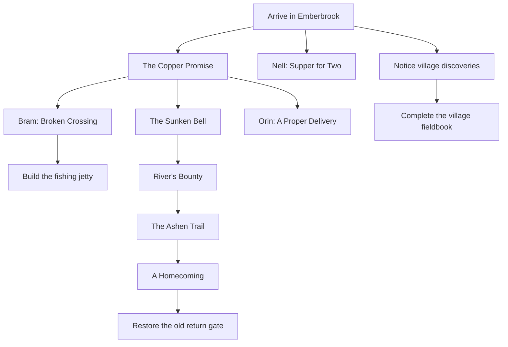

# Emberbrook: A Place You Know

Gameplay design, September 7, 2026. Implemented September 7, 2026.

All four deliveries below are implemented: residents and requests, fieldbook and
shortcut, construction and skill guidance, and homecoming. Costs match this plan.
The play guide documents the controls. Automated scenario tests cover the new
content alongside the original adventure; rendered previews cover the new panels
and world props. Human pacing and preference targets remain unverified.
The [play guide](README.md) is the source for current rules. This extends the
completed workbench, bridge, equipment, and animation milestone in [DESIGN.md](DESIGN.md).
Costs below are the current first-pass tuning; pacing targets still need playtesting.

## The experience to build

Make the player familiar with a small place: who lives here, what is around the
bend, where to get supplies, and what their work has changed. Keep the three
existing regions. Fill the journeys between objectives with things worth noticing
and give the player a few reasons to make a different journey next time.

The core rhythm is **choose a purpose → prepare → take a short trip → bring
something home → see a change**. A session should also support simply fishing,
making dinner, and helping a neighbour without needing to fight a boss.

Preserve the controls that now feel good: one click starts work; the forge and
fire use their selected recipe; release never stops an action. New content must
fit this rhythm. No extra confirmation for ordinary gathering or crafting.

## What needs filling in

The implementation already has meaningful equipment and food choices, a parallel
bridge project, and visible quest results. The remaining gaps are content:

- Elin still supplies the entire adventure chain. Other residents need small,
  personal purposes beyond acting as interfaces.
- Most destinations are resources, services, enemies, or mandatory objectives.
  There is little reward for investigating an otherwise unnecessary corner.
- Fishing is useful from the start, but its story purpose appears after the bell.
- Skill levels mostly make work faster. The Skills panel needs nearby, concrete
  things to look forward to; smithing is a crafting activity, not a sixth skill.
- The Hart pays 120 coins when most permanent purchases may already be finished.
  The chapter ends with an invitation to prepare for content that does not exist.

Do not solve these with more enemy health, another metal tier, or a larger map.
The next content budget is two residents, four requests, six discoveries, two
construction projects, one woodland shortcut, and one ending scene. Reuse the
seven existing inventory items. There are no required random drops.

## Structure of a playthrough

Keep the main adventure gates and charm timing intact for this pass. Moving the
Might charm before the Guardian would change the first boss's difficulty and
needs its own balance experiment.

Only the adventure spine is required for the ending. Requests, bridge, jetty,
gate, and fieldbook remain optional. Unfinished work survives chapter completion.
Offer one suggested objective and at most two alternatives in the Journal's
overview; additional available work belongs in a browsable list.

| Part of the session | Intended decision | Intended payoff |
|---|---|---|
| Arrival | Help Elin or catch supper first? | First useful craft and a resident who remembers it |
| After Copper Promise | Spend on defence, tools, or the crossing? | A distinct preparation or travel benefit |
| First expedition | Follow the objective or inspect a side alcove? | A discovery and a better understanding of the place |
| Between bosses | Finish village work or provision for the trail? | A visible improvement and useful supplies |
| After the Hart | Attend the homecoming, then choose any unfinished work | Closure, followed by optional mastery |

Target the first optional payoff within five minutes and a meaningful discovery,
unlock, or visible change every five to ten minutes. Keep the existing 45–60-minute
main-chapter target; optional completion can extend it. These are hypotheses,
not measured playtime. Cut deliveries before adding grind to reach a duration.

## Residents and four authored requests

Add **Nell**, Bram's sister, near the western cooking fire. She knows the river,
cooks for neighbours, and dislikes being treated as someone who needs rescuing.
Add **Orin**, the smith, beside the forge. He explains things through the work in
front of him and quietly takes pride in seeing his repairs around the village.
Elin remains responsible for the bell and trail; Bram handles trade and construction.

Each new resident has Talk and an explicit request action. Clicking the nearby
workstation still crafts. Give the NPC and station separate, legible hit targets.
Residents stay available at their service locations; decorative movements must
not obstruct paths or cause the player to chase a quest giver.

| Request | Available | Required hand-in | Reward and visible consequence |
|---|---|---|---|
| Supper for Two — Nell | Arrival | 2 grilled trout | 14 coins; two bowls appear by the fire; Nell introduces Bram as her brother |
| A Proper Delivery — Orin | Copper Promise complete | 2 bars + 4 logs | 16 coins; a repaired wheel appears at Bram's stall; Orin points out the rich vein and its tool requirement |
| Trail Lunches — Nell | Feast complete and crossing repaired | 3 smoked trout | 15 coins; packed lunches appear beside the southern gate; dialogue contrasts food per bite with food per slot |
| The Last Repairs — Orin | Hart quest turned in | 3 bars + 6 logs | 24 coins; repaired village sign and the player's name on its dedication |

These are one-time authored requests. No daily reset, random rotation, deadline,
or repeatable superior sale price. Ordinary trading remains the open-ended
gathering outlet. Acceptance does not require the player to have the materials.
Previously gathered supplies count, and talking about a recipe never changes
the recipe selected at its workstation.

One optional delivery can be accepted at a time; the player can freely abandon
it before handing in and accept it again later. The adventure and construction
projects can remain active alongside it. This bounds competing material needs.
Hand-ins consume the complete payment once and work only at the issuing NPC.
The player carries the supplies from the bank; no hidden withdrawal.

Selling reserves the sum of accepted delivery and active quest requirements for
that item. Eating and crafting may use those materials normally: survival and
the player's direct command take priority. Display exactly what a sale reserves.
Abandoning a request releases its reservation. Completed requests cannot pay again.

Sample exchanges establish tone in two or three lines:

> Nell: “Two trout, if you're fishing. Bram calls a ration supper. I disagree.”
>
> Orin: “The wheel's sound. It's the axle that's given up. Two bars, four logs,
> and Bram can stop carrying everything on his back.”

After the crossing, Nell mentions having visited Bram. After the bell, Orin can
hear when to stop working. After the Hart, Elin talks about ordinary village plans.
Use state-dependent lines and props to express change without long dialogue trees.

## Six discoveries, each tied to a place

Create a small fieldbook inside the Journal. Discoveries use persistent flags,
not backpack slots. Their world art must invite inspection: markings, a glint,
an unusual arrangement of stones, or a deliberate break in the scenery.
No pixel hunting, unseen random rolls, or required internet-style clue solving.

| Discovery | Placement and interaction | What the player gets |
|---|---|---|
| Flood Mark | Inspect a marked stone beside the damaged crossing; accessible before repair | The story of the flood, Bram named as the person to ask, fieldbook entry |
| Nell's Old Float | Inspect a glint near a starter fishing bank, then show Nell | A short family story and a painted float hanging by her fire |
| Quarry Marks | Inspect the rock face beside the rich vein; no tool required to read | A diagram explaining reinforced tools and the larger yield |
| The Bellmaker's Name | Inspect a tablet in a side alcove of the halls, away from the altar | A name later added to the restored village bell; finding it before or after the boss works |
| The Lost Way | Clear a fallen trunk between two existing forest paths | A permanent shortcut and the story of the original trail keepers |
| The Quiet Spring | Inspect a small pool off the Hart approach | A final piece of the forest story; its appearance changes after the Hart is defeated |

Inspect starts by approaching the landmark and completes once adjacent. The float
entry records discovery immediately; Nell's acknowledgement is an optional extra,
so a player never wonders why the book failed to count it. Late discoveries still
apply their village decoration, including the bell inscription.

The fallen trunk requires Woodcutting 3, takes one ordinary chopping action, yields
no inventory item, and stays cleared. The original route always remains passable.
It connects already accessible deep-forest paths and cannot bypass the feast gate,
beacon requirements, or the Hart's arena. Place and measure the routes during
implementation; target at least eight tiles saved between a beacon and the exit.

No discovery gives raw attack or protection. Completing all six lets Elin hang an
explorer's banner in the village and adds “Keeper of the Paths” to the Journal.
The book shows discovered names and broad hints for the rest; it does not reveal
exact coordinates. Main-quest guidance remains separate and more direct.

## Two permanent improvements

### Nell's fishing jetty

Available through Bram after the crossing is repaired. Costs **4 logs, 1 bar,
and 25 coins**, paid together. Construction replaces a ruined jetty prop near an
existing river route and creates a distinct fishing site. No new region.

The jetty requires Fishing 3 to use and yields **2 raw trout and 20 Fishing XP**
per successful action, then replenishes in **5 seconds**. Use the normal fishing
action duration. Starter shoals keep their current rules and remain viable.
At Fishing 3, the proposed jetty cycle is about 6.9 seconds for two fish versus
4.9 seconds for one at an ordinary shoal, excluding travel and tick rounding.
That is about 42% more fish per unit of stationary gathering time, not double.

Show both the construction cost and fishing requirement before payment. Building
early is allowed, but the panel must say if the player cannot yet fish there.
If only one of the two fish fits, collect neither and stop with a capacity message.
The fifth-catch pearl continues to follow total Fishing XP, preserving the current
guaranteed acquisition rather than adding a chance roll.

This gives fishing income a productive reinvestment and woodcutting/smelting a
shared project. Watch for the faster fish supply making combat preparation trivial;
tune yield or regrowth before changing existing food healing.

### The old return gate

After the Hart quest is turned in, Bram can restore a gate near the cleared forest
arena for **2 bars and 120 coins**. It provides one-way travel to the village.
The player still walks out through the forest to gather or revisit landmarks.
This turns the final reward into an optional convenience for continued exploration.

The gate is usable only when idle, without a marked attack, and with no living
enemy within six tiles. An unsafe click explains why it cannot activate and does
not queue a future escape. Show the destination on hover. Its endpoints must be
walkable and remain clear of services and NPCs. It is never needed to finish the
chapter or collect the fieldbook reward.

Both projects preview their benefit and full cost, use one explicit Build action,
consume nothing on insufficient payment, and save their completion. They do not
introduce upgrade menus for every building. A before/after sprite and a brief
resident reaction are enough for the construction moment.

## Skill goals and preparation

Keep five skills and the current XP formulas. Present the next actual benefit,
its requirement, and whether it is available now. Do not add empty level gates
to equipment that the player can already craft.

| Skill | Near-term purpose to show |
|---|---|
| Mining | Six ore for a sword; reinforced tools open the rich vein, independently of level |
| Fishing | Level 3 permits the constructed jetty; the pearl is guaranteed by accumulated fishing progress |
| Cooking | Existing level 2/3 grilled-trout healing; crossing unlocks the compact smoked recipe |
| Woodcutting | Logs for equipment, beacons, and construction; level 3 clears the Lost Way |
| Combat | Existing bonus every two levels, capped at +4; equipment and positioning remain relevant |

Keep sword/shield and spear as alternative loadouts. Keep grilled trout's stronger
single heal and smoked trout's two portions per slot. No new food, stamina bar,
durability, ammunition, or equipment rarity is needed for these additions.
Show healing amount and stack size together so the choice is understandable.

For the first Guardian trip, the Journal can suggest a weapon, shield or spear,
and several meals. It should warn about missing food without blocking departure
or silently equipping anything. New lore and village improvements must not occupy
boss warning tiles or make their shapes harder to read.

## Economy check

The current first quest leaves a player with 63 coins before spending: 8 starting,
15 from three mosslings, and 40 from Elin. The shield and tools together cost 50,
so an immediate 45-coin bridge payment already involves a choice. Preserve the
bridge's material alternative; do not fund every early purchase automatically.

The four new requests pay 69 coins in total. Their deliveries have an ordinary
sale value of 47 coins at current prices, a combined premium of 22. They primarily
add reasons and visible results to existing trades rather than a large money source.
The two new projects cost 145 coins plus materials. They are optional: the main
chapter must remain completable without grinding to afford them.

Record these values in playtests: coins at Copper Promise, first boss, and ending;
materials sold; project purchase order; meals used; extra trips solely for money.
If everyone fishes solely to buy the same compulsory-feeling upgrade, reduce its
necessity or cost. Do not increase all quest payouts as the first response.

## A Homecoming: an actual ending

Turning in the Hart quest retains the existing 120 coins and 60 Combat XP, then
offers **Join the homecoming**. This is optional and can be started later by Elin.
Require safety and no active action before opening the short celebration view.

Show the village's actual accomplishments: bell restored, feast prepared, trail
lit, plus optional crossing, jetty, and request props where earned. Nell and Orin
join Elin and Bram for a few short lines. Do not show unbuilt improvements or
describe undiscovered places as visited. Provide a visible Skip/Continue control.

End with “Emberbrook is safe. This chapter is complete.” and two actions:
**Return to the village** and **View unfinished work**. No locked next-region
teaser presented as an active objective. The main story is done; gathering,
requests, discoveries, and construction remain available. Replaying the scene
does not repeat the quest reward. A replay contains no new payment or unlock.

## Delivery order and acceptance

Ship small playable slices; avoid landing every new screen before any content works.

| Delivery | Concrete scope | Evidence required |
|---|---|---|
| 1. People and purpose | Nell, Orin, first two requests, resident reactions | A player can accept, deliver, abandon, and resume; reservations add correctly; one-time rewards persist; workstation clicks still craft |
| 2. Things to discover | Fieldbook, six landmarks, Lost Way | Every landmark reachable at its intended stage; no gate bypass; shortened path measured; no duplicate rewards; late discoveries update props |
| 3. Work worth doing | Jetty, last two requests, skill milestone text | Both fishing sources work; full-pack collection is atomic; insufficient project payment consumes nothing; claims match actual XP and rewards |
| 4. A finished chapter | Homecoming and return gate | Ending works with zero optional completions and with all; skip/replay preserve state; unsafe travel rejected; unfinished work remains available |

Use small definitions and explicit quest/project flags in the demo layer, not a
generic quest scripting framework. Keep claim predicates shared by Journal,
dialogue, and transactions. Save discovered, accepted, completed, and constructed
state; cancel transient actions on load. Save migrations are not required.

Extend the real Engine harness for transactions, complete mouse gestures, route
reachability, gating, and completion in different orders. Review map and panel
renders at the existing virtual resolution for crowding, clipping, and hit targets.
Automated completion establishes correctness, not whether the content is enjoyable.

Human checks for each slice:

1. Start fresh without coaching. Can the player find supper or the sword, and
   explain their next goal? Log confusion and first useful reward time.
2. Offer bridge, bell, and a request. Observe the choice without steering it.
   Ask what would make the other option attractive.
3. Walk an expedition route. Does the player notice a discovery without a marker
   pointing straight at it? Does its reward justify the detour?
4. Finish with minimum optional content, then inspect a completionist save.
   Both should feel like a finished chapter; unfinished work should be inviting.

After each session, record observed timings and one change to try. With the four deliveries implemented, the next priority is observing a fresh
player choose and complete their first village request without coaching.
